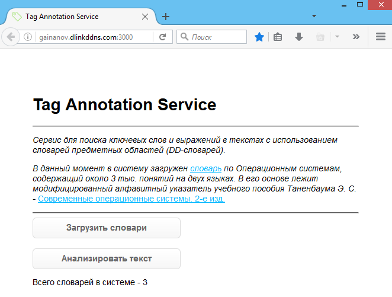

# TagAnnotationService
Web-service for annotation text in the form of keywords (KW). KW is words or phrases extracted from text.
Keywords  are  chosen  from  a  controlled  vocabulary  of  terms. 
Documents are classified according to their content into classes (manually) that correspond to elements of vocabulary. 
